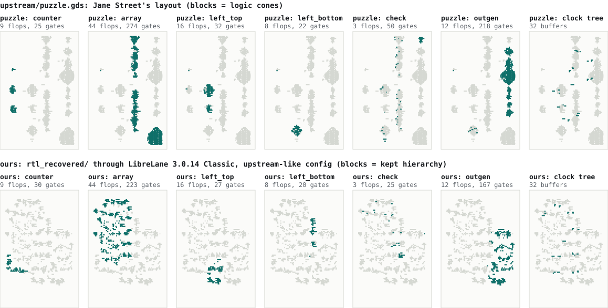

# ROUNDTRIP — the recovered RTL through Jane Street's flow and back (PRD S4)

**What this is.** Stretch goal S4: infer Jane Street's forward flow, harden `rtl_recovered/` with
it, and check the result with RETRACE's tools. Measured on 2026-09-21 on one macOS arm64 host,
LibreLane and the Yosys 0.62/0.66 runs in linux/arm64 LibreLane containers, the rest natively;
repeated in CI on x86_64 with byte-identical results (§9).
Paths under `out/roundtrip/` are local evidence, git-ignored and not in this repository (§9 says
what `ci.sh` regenerates); `upstream/` and `pdk/` are local copies. §6-§8 quote
`out/roundtrip/verify_doc/ci/`, a `tools/roundtrip/ci.sh --no-harden` run (18:53-18:57) which, like
`out/roundtrip/ci/`, predates the 19:01 edits to `loop.py` (`kill_tree()`, §7), `compare.py` and
`puzzle_rt.py`; `check`, `loop` and `vs_puzzle` rerun with the current code on upstreamlike agree
but for timings (not retained). Reviewers reran §3, §4 and §6-§8; their corrections are marked,
and results without an artifact "not retained".

## 1. Question and answer

**Question.** `docs/STATUS.md` gave S4 three purposes: compare our RTL's cell mix and area,
synthesized Jane Street's way, with the puzzle's (plain synthesis or hand-padded?); add a second
sky130 GDS of known source; and prove our extracted GDS equivalent to the recovered RTL.

**Answer.** LibreLane Classic (most likely 3.0.0rc0-3.0.5) on open_pdks 8afc8346, hierarchy kept,
fill and design repair off (§2). `AREA 0` reproduces the warm-up netlist exactly (§3), though Jane
Street says only that the warm-up went through "a very similar flow"; for the puzzle the strategy
evidence is split (§4.4). With that recipe our RTL gives a floorplan identical to `puzzle.gds`
(880/880 taps and endcaps, 13/13 pins, 30/30 straps, 1962/1962 PDN vias); gates (492 against 604)
and placement differ (§5, §8). Without fill, DRC and LVS fail on n-well findings only: untapped
islands (nwell.4, LU.3, floating `VPB` nets) and spacing and width at gaps of one to three sites
(nwell.2a, nwell.1, hvtp.1, hvtp.2), the same kinds as `puzzle.gds` (127 untapped islands; 731
Magic, 176 KLayout findings); with fill our layout is clean (§5). Our GDS passes RETRACE's layout
oracles V1-V5 and three new ones (§6); its extracted netlist is proven equivalent to
`rtl_recovered/` and to `puzzle.gds`'s and replays to `(* TWO STARS *)` (§7). No sign of hand
padding: every master is one plain LibreLane synthesis picks, and recipe plus partition could
explain the size, but no tested recipe matches both count and mix. Under AREA 0 (favoured by the
warm-up and the mix) the puzzle has 19.2% more cells, about 7 directly attributable to kept module
boundaries, the rest inference; keep + `DELAY 0` (reviewer; favoured by block sizes) gives exactly
its 696 but 0 `xor2`/`xnor2` against 50 (§4).

## 2. Identifying the forward flow

Jane Street's repository (`upstream/`, janestreet/asic-puzzle-2026 at `ffd53e0`, committed
2026-08-05) records no tool versions. Part 1 read the settings off `upstream/puzzle.gds` and
`upstream/warmup/` (`out/roundtrip/part1_results.json` key `forensics`; `out/roundtrip/forensics/`).

### 2.1 Flow and version

**PDK.** The masters of both GDS match open_pdks `8afc8346` (`docs/STATUS.md`), pinned by LibreLane
3.0.0.dev28-3.0.14 and by no other release tag from 2.0.0rc2 on
(`out/roundtrip/forensics/ll_pdk_pins.txt`). That file says `none` for 35 tags (2.4.0-2.4.13,
2.4.0.dev2-dev16, 3.0.0.dev22-dev27) because `fetch_pins.sh` never read `librelane/open_pdks_rev`,
which pins `0fe599b2` in all 35 (`out/roundtrip/verify_doc/ll_pdk_pins_none.txt`).

**Version.** The warm-up DEF puts `CTS_NDR_0` (minimum widths, doubled spacing) on its upper clock
nets `clk` and `clknet_0_clk` only: `CTS_APPLY_NDR`'s `half` strategy (upper half of the tree
levels), which per Part 1 needs OpenROAD `dfc4f595` or later. That first shipped in 3.0.0.dev48, but
dev48-dev52 lack `CTS_APPLY_NDR` and their `cts.tcl` passes no `-apply_ndr`, so they may not make
the rule at all (untested). The GDS headers (BGNLIB) date the post-processing (both GDS carry the
1366 logo squares), an upper bound on each flow run: `upstream/warmup/04_final.gds` 2026-07-30,
before 3.0.6 reached PyPI (2026-08-02), `puzzle.gds` 2026-08-05, the commit day. If both designs
used one version, 3.0.0rc0-3.0.5 are likely (3.0.6 fits the puzzle alone) and dev48-dev52 not
excluded. Per tag (`out/roundtrip/verify_doc/ll_versions.txt`, made by `ll_versions.sh` there):

| LibreLane | OpenROAD | `CTS_APPLY_NDR` | Yosys (nix-eda) | open_pdks |
|---|---|---|---|---|
| 3.0.0.dev47 | `341650e7` | no | 0.60 (6.0.1) | `8afc8346` |
| 3.0.0.dev48-dev52 | `dfc4f595` | no | 0.60 (6.0.1-6.0.2) | `8afc8346` |
| 3.0.0rc0-3.0.1 | `dcf36133` | default `half` | 0.62 (6.4.0-6.11.0) | `8afc8346` |
| 3.0.2-3.0.14 | `dcf36133` + `grt_pin_layers.patch` | default `half` | 0.62 (6.11.0) | `8afc8346` |
| 3.1.0.dev1 / dev2, dev3 | `dcf36133` + patch | default `half` | 0.62 / 0.66 | `d815bb30` / `74c0e6b1` |

We ran 3.0.14 (Yosys 0.62, Magic 8.3.623, Netgen 1.5.316, KLayout 0.30.7). 3.1.0.dev3 builds the
same OpenROAD source (`dcf36133` with the GRT patch) but not the same build: nix-eda 7.0.0 against
6.11.0, different Nix derivations and `bin/openroad` hashes (both local images, not retained);
3.0.0rc0-3.0.1 lack the patch. Part 1 rated the flow **high**: a 3.1.0.dev3 run on the warm-up
source reproduces its DEF header, rows, taps, endcaps, 79/79 instance names and masters, pins, NDR
and SPECIALNETS, and differs in placement (0/79), routing and the routing `BLOCKAGES`
(`out/roundtrip/forensics/cmp_warmup_e1.txt`). Its rejection of other flows is not re-verified.

### 2.2 Settings

Confidence is Part 1's unless noted. "Reproduced": as set in `tools/roundtrip/puzzle/config.json`
(groups commented MEASURED or GUESS) it gives the puzzle's geometry in our run (§8). Not reproduced:
`CLOCK_PERIOD` (unobservable), placement, the keep-out extent (a guess) and the diodes.

| Parameter | Value | Evidence | Conf. |
|---|---|---|---|
| Views | `01` = `final/nl`, `02` = `final/pnl`, `03` = DEF, `04` = KLayout GDS, post-processed | 01-03 hold the same 230 instances; Jane Street added 1366 met2 logo squares and the `INTERNAL_3/7` Morse strip on 200/0 | high |
| Floorplan | `DIE_AREA [0,0,200,300]`, `CORE_AREA [10,10,190,290]`; `decap_3` endcaps, `tapvpwrvgnd_1` every 13 um | only a core margin in (9.84, 10.02] um fits both designs. Reproduced: 102 rows, 880/880 taps and endcaps | high |
| Fill | `RUN_FILL_INSERTION false` | every `decap_3` an endcap; 79.9% of sites empty; 47 one- and 23 two-site gaps (`out/roundtrip/forensics/place_forensics.txt`) | high |
| Cells | PDK `no_synth.cells` + `drc_exclude.cells`; insbuf `buf_2`; hilomap `conb_1` | 192 of 428 cells; 62 of 63 pre-CTS masters are their family's smallest allowed size, all but insbuf's `buf_2` (`buf_1` is allowed); 6 `conb_1`, one per pin (§4.1) | high; insbuf, ties medium |
| Hierarchy, strategy | `keep`, `AREA 0` | per-module names (`sr_a/_08_`); only keep AREA 0 of AREA 0-3, DELAY 0-4 reproduces the warm-up (§3), whose flow is only "very similar"; on the puzzle the evidence is split (§4.4) | `keep` high; `AREA 0` high for the warm-up, split for the puzzle |
| Repair | post-GPL design repair and post-CTS timing off | no port or hold buffers; `rst_n` drives 88 sinks unbuffered | high |
| CTS | `clkbuf_16` root, `clkbuf_8/4/2`, `CTS_APPLY_NDR half` | 16 `clkbuf_8` leaves of 5-6 flops, 15 `clkbuf_4` dummy loads. Shape reproduced | high |
| Antenna | repair on, heuristic off | 10 `diode_2` on 5 nets; our run inserted none | medium |
| PDN | 2 um met4/met5 straps, 30 um pitch | reproduced 30/30 straps, 103/103 rails, 1962/1962 vias | high |
| Pins | `IO_PIN_ORDER_CFG` with virtual pins (`tools/roundtrip/puzzle/pin_order.cfg`) | only `io_place.py` solution within the search bounds (<= 6 virtual pins per gap on W, <= 3 on E; `out/roundtrip/forensics/pinplace_search.txt`). Reproduced 13/13 | high |
| Logo keep-out | `ROUTING_OBSTRUCTIONS` met2 + met3 | warm-up DEF keeps `BLOCKAGES` over its logo; puzzle extent unknown, `[30,30,57,57]` a guess | medium |
| Clock period | unobservable; 10 ns used | the warm-up netlist is identical at 1 and 10 ns | low |
| Placement | warm-up: modules at points, then detailed placement | per Part 1 (`out/roundtrip/forensics/dplsim/`, not re-verified) 75/76 warm-up cells reproduced; global placement 0/76 | low |

Correction to Part 1's summary: its validation run (`out/roundtrip/forensics/ll_puzzle/runs/p1`)
differs from the suggested config's run (`ll_puzzle_sugg/runs/s1` there) only in
`PRIMARY_GDSII_STREAMOUT_TOOL` (p1: Magic), and ran in the 3.1.0.dev3 image (Yosys 0.66).

### 2.3 What stays unknown

The placement mechanism: the puzzle's clusters (bin density p10 0.91, ours 0.57) are not reproduced;
per Part 1, legalising three from single points reproduced 2/14, 3/35 and 2/26 cells (not
re-verified). The version: 3.0.0rc0-3.0.5 ship Yosys 0.62, which reproduces the warm-up; dev48-dev52
ship 0.60, untried. 3.1.0.dev1 (0.62) and dev2 (0.66; the dev3 image's 0.66 is exact on the
warm-up, dev2's own nix-eda 6.24.0 build untried) predate the puzzle and are unlikely, not excluded:
their default PDKs (`d815bb30`, `74c0e6b1`) were never compared with the puzzle's masters
(STATUS.md's samples either side differ), and a PDK can be chosen (Part 1 ran dev3 on 8afc8346);
dev3 postdates the puzzle. The keep-out: the logo spans x 34.9-52.0, y 35.2-52.3 um; per Part 1 any
met2/met3 box covering it, left of x = 58.5 um above y = 41 and below y = 72.2 um, fits.

## 3. Synthesis calibration on the warm-up

`tools/roundtrip/synth.py` transcribes LibreLane 3.0.x's `synthesize.py` and ABC script into plain
Yosys. Recipe `warmup` (sky130 defaults plus keep; Yosys 0.62 in the 3.0.14 image) keeps 192 liberty
cells, maps with `abc -fast` then `AREA 0`, adds hilomap ties and insbuf buffers, and sorts the
design after every `opt` as LibreLane does (unsorted, Yosys 0.66 and 0.69 give 77 cells at histogram
L1 21 and 27). From `upstream/warmup/00_source.v` it gives 76 logic cells, 1007.216 um2, as
`01_netlist.v` has (`out/roundtrip/calib/warmup/compare.json`): histogram L1 0, isomorphic labelled
graphs, every instance (`add0/_32_`, ...) with the same name, master and pin nets; the unsorted 0.66
result fails all three, `deferred_flatten` the names. On `rtl_recovered/` the hardening's own
synthesis (`out/roundtrip/puzzle_run/upstreamlike/06-yosys-synthesis/`) equals recipe `warmup`'s
(`out/roundtrip/rt_synth/warmup/netlist.v`) byte for byte.

**Review** (`out/roundtrip/part1_results.json` key `calibVerdict`; `out/roundtrip/verify_calib/`).
An independent checker without RETRACE code or Yosys agrees (L1 0; 157 nodes, 279 edges; 0 name
mismatches); first kept outside the repo, it is now `out/roundtrip/verify_calib/indep_check.py` and
reruns the same, but its negative controls are not retained. Networkless synthesis, the 62-attempt
sweep and LibreLane's own `synthesize.py` all reproduce. Of three cosmetic faults two are fixed;
Part 1's summary still says 34 attempts for `out/roundtrip/calib/explore/sweep1.log` (32 lines).

Final sweep, histogram L1 to the warm-up (`out/roundtrip/calib/sweep/attempts.tsv`):

| Yosys | flatten | deferred | keep AREA 0 | AREA 1 | AREA 2 | AREA 3 | DELAY 0-4 | keep, no sort | no/partial exclusions |
|---|---|---|---|---|---|---|---|---|---|
| 0.69 (oss-cad-suite) | 50 | 6 | 6 | 38 | 30 | 148 | 101-121 | 27 | 116 |
| 0.66 (3.1.0.dev3 image) | 48 | 0, names differ | **0, exact** | 32 | 30 | 155 | 106-125 | 21 | 115 |
| 0.62 (3.0.14 image) | 48 | 0, names differ | **0, exact** | 32 | 30 | 155 | 106-125 | 0 | 115 |

No netlist here has a `clk*` master, so counting by name changes nothing. Correction: an earlier
version took three entries from stale directories in `out/roundtrip/calib/sweep/`; `attempts.tsv` is
right. Caveat (reviewer): `01_netlist.v` is flat and post-PnR, so "synthesized with hierarchy kept"
is an inference.

## 4. Synthesis of the recovered RTL vs the puzzle

### 4.1 The puzzle's pre-CTS cell count

`upstream/puzzle.gds` has 1618 instances: 728 logic, 676 taps, 204 `decap_3`, 10 `diode_2`. Less the
32 CTS cells, synthesis made **696 cells, 8033.96 um2**: 92 flops and 604 gates, all `_2` but 21
`mux2_1` and 6 `conb_1` (recounted by both reviewers, `out/roundtrip/verify_rt/gds_count.json`).
Each `conb_1` drives one pin, as synthesis makes them: hilomap without `-singleton` makes one per
connection, and LibreLane 3.0.14 runs `repair_tie_fanout` only in `repair_design.tcl`
(`RepairDesignPostGPL`), which is off here.

### 4.2 Recipes

Yosys 0.62 unless noted; ratio = puzzle cells / ours. Sources: `out/roundtrip/rt_synth/` (Part 1),
`out/roundtrip/verify_rt/sweep_summary.txt` (reviewer, R).

| Recipe | Cells | Gates | Area um2 | Ratio | L1 to puzzle | Note |
|---|---|---|---|---|---|---|
| **puzzle** | **696** | **604** | **8033.96** | | | |
| keep, AREA 0 (recipe `warmup`) | 584 | 492 | 6981.70 | 1.192 | 304 | what we hardened; 587 on Yosys 0.66, 577 on 0.69 |
| keep, AREA 1 / 2 (R) | 583 / 568 | 491 / 476 | 6949.16 / 6812.78 | 1.194 / 1.225 | 287 / 320 | |
| flatten, AREA 0 (LibreLane default) | 554 | 462 | 6656.38 | 1.256 | 312 | 557 on 0.66 |
| flatten, AREA 1 / 2 (R) | 551 / 549 | 459 / 457 | 6632.61 / 6628.86 | 1.263 / 1.268 | 265 / 317 | |
| **keep, DELAY 0** (R) | **696** | **604** | 8150.32 | 1.000 | 396 | +1.4% area |
| keep, DELAY 1 / 2 / 3 (R) | 678 / 669 / 678 | 586 / 577 / 586 | 7975.15 / 7875.05 / 8041.46 | 1.03-1.04 | 430 / 443 / 418 | |
| flatten, DELAY 0 (R) | 598 | 506 | 7415.86 | 1.164 | 404 | |
| keep DELAY 4 / keep, flatten AREA 3 (R) | 667 / 953 / 833 | 575 / 861 / 741 | 7846.28 / 9205.08 / 8252.92 | 1.04 / 0.73 / 0.84 | 511 / 973 / 789 | buffers, upsizing: out |
| flatten, no `no_synth.cells` / no lists | 619 / 620 | 527 / 528 | 5333.87 / 5331.36 | | 1307 / 1306 | mostly `_1`: out |

Correction: Part 1 first gave the last two as 609 and 611 (still in `part1_results.json`
`rt.recipes`), counting 10 and 9 `clkinv_1` data inverters as clock cells by name; the tools now
split by connectivity (`synth.cell_kinds()`), and `out/roundtrip/rt_synth/summary.json` says 619/620.

### 4.3 Equivalence

All seven Part 1 netlists are proven sequentially equivalent to `rtl_recovered/` by the V7 miter
(`formal/recovered_miter.sv`: `O`, `success` and all 92 flops equal after reset; SymbiYosys `abc
pdr`, about 1 s each), and mutants fail. Reviewers added keep DELAY 0 and 3 and flatten AREA 1 (five
of six mutants fail; the sixth stayed open under PDR but fails a block-level SAT miter) and
co-simulated against the RTL (`out/roundtrip/verify_rt/sim/*.vvp` rerun; logs not retained): 0
errors for the seven Part 1 netlists over 200k random cycles and keep DELAY 0 and 3 over 50k (flatten
AREA 1 not simulated), comparing `O`, `success` and 92 registers (91 in the four flatten netlists:
`f78` unmatched by name); two mutants give 129k and 583k errors.

### 4.4 Interpretation, as corrected by the reviewers

Part 1 read the puzzle as 19% larger, with about 96 cells of boundary redundancy; the reviewers
(`rtVerdicts`) refuted parts. What stands:

1. **Plain LibreLane sky130 synthesis** (default subset, our flops' masters, no resizer buffers).
   **Size depends on the recipe**: under AREA 0 the puzzle has 19.2% more cells (696/584), 15.1%
   more area; AREA 0-2 give 1.19-1.27; keep + `DELAY 0` gives exactly 696 cells, 604 gates.
2. **The evidence on the strategy is split.** For AREA 0: (a) on the warm-up (a "very similar"
   flow) keep DELAY 0-4 give 96-129 cells, not 76 (`out/roundtrip/verify_rt/warm_sweep_summary.txt`);
   (b) the puzzle has 50 `xor2`/`xnor2`, AREA 0-2 give 21-28, keep DELAY 0-3 0-4, flatten DELAY 0-3
   13-15, and the family mix's total-variation distance is 0.21-0.26 for AREA 0-2 against
   0.315-0.374 for DELAY 0-3 (`out/roundtrip/verify_doc/keep_blocks.txt`,
   `out/roundtrip/verify_rt/mix_summary.txt`); (c) histogram L1 is 265-320 for AREA 0-2, 371-511 for
   DELAY 0-4. For DELAY: keep DELAY 0 hits the total, and per block (`keep_blocks.txt`) the sum of
   |gates - puzzle's| over the six blocks is 67-94 for keep DELAY 0-4 against 130-145 for keep AREA
   0-2 (DELAY 0 93, AREA 0 139); only on `counter` and `left_bottom` is AREA closer (keep DELAY 0-3
   32-36 and 31-34, AREA 1-2 25 and 20, puzzle 25 and 22), and on `array` the ranges overlap (AREA 1
   225, DELAY 2 221, puzzle 274).
3. **Boundaries.** Resynthesizing the puzzle's own gates flat returned 600 of 696 cells (508 gates,
   92 flops): 96 removed (13.8%; reviewer 95). The same control removes 0.9% of flat AREA 0, 2.4% of
   keep AREA 0, 8.4% of boundary-free flat DELAY 0, 15.2-17.1% of keep DELAY 0-3
   (`out/roundtrip/verify_rt/control_summary.txt`) and 22.4% of `01_netlist.v` (76 to 59,
   `out/roundtrip/rt_synth/summary.json` key `control`): it measures sub-optimal mapping, not
   boundaries. **About 7 cells are directly attributable**: 6 `conb_1` (5 in `outgen`) and a
   `left_top` `buf_2` whose input and output feed one `a22o_2`. A reviewer's test
   (`out/roundtrip/verify_rt/tie_test/`) makes such a `conb_1` from a constant-tied submodule port
   under keep only, so Jane Street's RTL had boundaries somewhere; ours passes no constant across
   one (0 `conb_1`), so the partitions differ.

### 4.5 Per block

Puzzle blocks are `tools.viz.puzzle.block_cells()` cones (`out/roundtrip/verify_rt/cones.txt`; 14
gates count in several; "Split" shares them); "Ours" is `rec_<block>` alone; "Control" is the
puzzle's cone resynthesized flat (`out/roundtrip/rt_synth/summary.json` key `control`; `outgen`: 172
less the 8 `buf_2` the conversion adds, as in Part 1's `rt.recipes`).

| Block | Flops | Puzzle gates (shared) | Split | Puzzle um2 | Ours | Ours um2 | Excess | Control | Removable |
|---|---|---|---|---|---|---|---|---|---|
| counter | 9 | 25 (2) | 23.7 | 260.25 | 30 | 269.01 | -5 | 29 | none |
| array | 44 | 274 (9) | 269.2 | 2502.40 | 223 | 1954.37 | +51 | 250 | 24; 27 remain |
| left_top | 16 | 32 (2) | 30.7 | 300.29 | 27 | 272.76 | +5 | 28 | 4 |
| left_bottom | 8 | 22 (3) | 20.2 | 193.94 | 20 | 190.18 | +2 | 19 | 3 |
| check | 3 | 50 (10) | 45.0 | 377.86 | 25 | 251.49 | +25 | 25 | all 25 |
| outgen | 12 | 218 (5) | 215.2 | 2113.28 | 167 | 1646.58 | +51 | 164 | 54 |

The puzzle's `outgen` has 20 `a22o_2`, 5 `conb_1` and 11 `o31a_2` against our 1, 0 and 3. In `array`
(+27) and, by one gate, `left_top` the puzzle's own structure still maps larger than our RTL; its
array has 19 `xor2`/`xnor2`, ours none.

## 5. Hardening

`tools/roundtrip/puzzle/harden.sh` runs `tools/roundtrip/puzzle/config.json` (Part 1's suggested
config on `rtl_recovered/`, placement at defaults) in `ghcr.io/librelane/librelane:3.0.14`.
**upstreamlike** is the config as inferred, no fill, with DRC and LVS errors set to warn; **clean**
adds fill, checkers at defaults. With default checkers the no-fill run still finishes all 73 steps
(exit 2, `out/roundtrip/puzzle_run/probe_defaults.status`) with the same DEF.

| | upstreamlike | clean |
|---|---|---|
| Exit status; wall time (retained records) | 0; 46-86 s (`out/roundtrip/puzzle_run/upstreamlike.status`, `out/roundtrip/puzzle_harden.log`) | 0; 59-64 s |
| Instances / gates / flops / clock buffers / diodes | 1496 / 492 / 92 / 32 / 0 | 12886 (11390 fill) / same |
| Magic DRC | 1267: LU.3 786, nwell.4 260, nwell.2a 200, nwell.1 21 | 0 |
| KLayout DRC | 287: nwell.2a 161, nwell.1 42, hvtp.1 42, hvtp.2 42 | 0 |
| Netgen LVS | 314: 211 net differences (all extra `<inst>/VPB`), 101 device differences, 1 unmatched net and device | 0, "Circuits match uniquely" |
| XOR, overlap, routing DRC, disconnects, PDN, antenna | 0 | 0 |
| Setup WS at 10 ns | max_ss -0.632, nom_ss -0.563, min_ss -0.491 ns; nom_tt +3.925 | same |
| Hold WS; max slew / cap / fanout violations | +0.029 ns; 387 / 2 / 20 | same |

Sources: `out/roundtrip/puzzle_run/` (`*.summary.json`, `final/metrics.json`). The clean DEF equals
upstreamlike's apart from fill; DEF, `nl.v` and `pnl.v` hashes before the last `ci.sh` run
(`out/roundtrip/puzzle_run_hashes_before.txt`) equal those after (`out/roundtrip/ci/identity.json`).
The 5 setup violations (max_ss 2, nom_ss 2, min_ss 1) are two paths from one flop, `_82_/Q` to
`O[0]` and `O[4]` (`violator_list.rpt`, `max.rpt` in
`out/roundtrip/puzzle_run/upstreamlike/52-openroad-stapostpnr/*_ss_*/`); register-to-register paths
have none (+2.60 ns at max_ss). So the miss comes from LibreLane's default I/O constraint
(`IO_DELAY_CONSTRAINT` 20%: a 2 ns output delay), not the logic, and only warns.

### 5.1 Why the no-fill layout fails DRC and LVS, and why puzzle.gds does too

sky130_fd_sc_hd cells have no well taps: each cell, fill included, draws n-well (64/20) 0.19 um past
its sides and hvtp (78/44) to its edges, and only `tapvpwrvgnd_1`, about every 13 um, ties the
merged n-well to VPWR, which works only if each row pair's strip is continuous. Fill makes it so;
without fill it breaks at every gap (`tools/roundtrip/puzzle/wells.py`,
`out/roundtrip/puzzle_gds_signoff/wells.json`):

| GDS | n-well islands | untapped | P+ regions in untapped islands |
|---|---|---|---|
| ours, upstreamlike / clean | 855 / 51 | 211 / 0 | 400 / 0 |
| **`upstream/puzzle.gds`** | 737 | 127 | 274 |
| our warm-up / **`upstream/warmup/04_final.gds`** | 136 / 120 | 47 / 34 | 94 / 63 |

**Untapped islands** (211) give Magic nwell.4 (260) and LU.3 (786, from the 400 P+ regions without a
tap in their well; Magic counts error boxes, not islands or regions); extraction makes each island a
node with its cells' VPB pins (363 on 211 nets), which `pnl.v` ties to VPWR, so Netgen reports those
nets and the device mismatches they cause. **Gaps of one to three sites** (0.46, 0.92, 1.38 um)
leave n-wells 0.08, 0.54 and 1.00 um apart, under the 1.27 um minimum (KLayout space check, not
retained: 57, 57 and 36 edge pairs; `puzzle.gds` 53, 29, 36), and some n-well too narrow: Magic
nwell.2a 200, nwell.1 21; KLayout, with no tap-coverage rules, reports only such spacing and width
findings (nwell.2a, nwell.1, and hvtp.1/hvtp.2, as hvtp follows the n-well).

**puzzle.gds is in the same state.** LibreLane 3.0.14's `Magic.DRC`, `KLayout.DRC` and
`Magic.SpiceExtraction`, run standalone (`out/roundtrip/puzzle_gds_signoff/`; they reproduce our
flow's counts), give Magic 731 (LU.3 438, nwell.4 146, nwell.2a 141, nwell.1 6), KLayout 176
(nwell.2a 140, nwell.1 12, hvtp.1 12, hvtp.2 12), and 127 floating VPB nets. Extraction needed
`MAGIC_CAPTURE_ERRORS=false`: Magic reports an error reading the 200/0 cells (`Error while reading
cell "INTERNAL_3" ... Unknown layer/datatype`;
`out/roundtrip/puzzle_gds_signoff/puzzle/magic_ext/magic-spiceextraction.log`), absent from the DRC
log. Netgen was not run, lacking a power-aware schematic.

## 6. Verification of our GDS

`python -m tools.roundtrip.check RUN_DIR` runs RETRACE's oracles V1-V5 (`docs/spec/VERIFICATION.md`,
V3 split in two) and X, CC and XS, which `check.py` defines, on each stream-out against the run's own
DEF and `nl.v`. Upstreamlike, KLayout GDS (`out/roundtrip/verify_doc/ci/check_upstreamlike.log`):

| Oracle | What it checks | Result |
|---|---|---|
| X | extractor 1 (`tools/retrace/extract.py`) raises no diagnostic | 1496 instances (616 logic: 492 gates, 92 flops, 32 clock buffers), 622 nets |
| V1 | extracted (master, x, y, orient) multiset = DEF COMPONENTS | 1496/1496; 67 masters |
| V2 | pin names = LEF; each LEF li1/met1 pin rectangle on its own pin only | 419 pins, 624 rectangles, 0 wrong |
| V3a | net partition = DEF NETS | 605/605 (plus 15 dummy-load outputs DEF omits) |
| V3b | labelled-graph isomorphism with `nl.v`; partition by name | isomorphic (616 cells, 605 nets, 2371 edges); 605/605 |
| V4 | KLayout LayoutToNetlist (`tools/l2n`) = extractor 1 | 607/607 multi-member nets |
| V5 | ports, one net per supply reaching all, one driver per net, no floating input | 13/13; 1496/1496; 620 nets, 0 bad |
| CC | every master identical to the PDK GDS on a 1 nm grid | 67/67 |
| XS | extractor 1's partitions identical across stream-outs | 622 = 622 |

The Magic and both clean stream-outs (12886 instances) pass likewise, with byte-identical extracted
netlists; 16-39 s per variant in the two retained runs
(`out/roundtrip/{ci,verify_doc/ci}/steps.tsv`). **Flat cuts:** Magic writes its 15,023 vias as
top-level cut polygons, which extractor 1 ignored silently until Freeze 2 (7016 nets, 0/605 matched;
`out/roundtrip/review_check/logs/noflat.log`); `tools/roundtrip/check.py` bound them then
(`FlatCutExtraction`), and since Freeze 2 extractor 1 binds them itself (`Extraction(top_cuts=True)`, the
default; `--no-flat-cuts` reproduces the failure), and X fails on any left unbound. Both stream-outs have the same cuts by layer
and box (`out/roundtrip/verify_doc/cut_multisets.txt`), and LibreLane's XOR of them is 0 (a
reviewer's 38-layer XOR is not retained). **Dummy loads:** `nl.v` omits the 15 `clkload*` X pins, so
`check.py` drops single-output-pin nets on both sides if the counts agree. **Blind spot:** the
oracles ignore wells by design; upstreamlike passes them and fails LVS (§5.1).

**Negative controls** (`out/roundtrip/check/neg/`; the reviewer's in `out/roundtrip/review_check/`):

| Fault | Caught by |
|---|---|
| via deleted; met1 widened into a short; via inserted as a short | V3a, V3b, V5 |
| `mux2_1` flipped; master `nor2_2` -> `nand2_2` | V1, V3a, V3b, V5 (the flip also V4) |
| private master copies: A/B labels swapped; `mux2_1` poly shape deleted | V2 and CC; CC (both also V1, V3a, V3b by name) |
| the same, edited in place in the GDS's master cell | V2, V3a, V3b; CC only |
| path end shifted 7 nm; end type changed | none, correctly: still overlapping |
| reviewer: met4 VPWR-VGND short; `O[0]`/`O[1]` labels swapped | V4, V5 only; V3a, V3b only |
| reviewer: one of 108 PDN via4 cuts deleted | none: the grid stays connected |
| reviewer: Magic GDS flat via1 deleted or shorted, flat mcon deleted | V3a, V3b, V5 |
| reviewer: `nl.v` rewired; DEF NETS rewired; clean GDS vs upstreamlike DEF | V3b; V3a; V1 |

Correction: the first `check.py` "caught" the private-copy mutants only by crashing (`KeyError`); it
now reads them with their base master's LEF, and a rerun catches both as shown
(`out/roundtrip/verify_doc/neg_rerun/`; `out/roundtrip/check/neg/results.json` predates the fix).
The warm-up round-trip run (`out/roundtrip/warmup_run/upstreamlike_rt`) passes too; it is not §5.1's
`warmup_run/upstreamlike`, and its checkers were not demoted, so LibreLane exited 2 on 263 Magic DRC,
96 KLayout DRC and 76 LVS errors (`out/roundtrip/warmup_run/upstreamlike_rt.{status,log}`).

## 7. Closing the loop

`python -m tools.roundtrip.loop RUN_DIR` (58-90 s in the retained runs) checks the KLayout GDS with
RETRACE's tools only (`out/roundtrip/verify_doc/ci/loop.log`; earlier runs in
`out/roundtrip/{ci,loop,review_loop}/`).

1. **Extract**: 1496 instances, 616 logic cells, 0 diagnostics, all DEF components and nets matched;
   every flop's CLK reaches `clk` through `clkbuf_16` then `clkbuf_8`, uninverted.
2. **Prove against `rtl_recovered/`** (V7 miter). The 92 flop probes come from the DEF or from
   simulation alone (identical traces over 2688 cycles: 90 unique pairs, all as the DEF says; `f76`
   and `f77` stay 0, so 2 candidate maps). **PASS in 1.1-1.9 s** with DEF probes in every retained
   run; with simulation probes one candidate FAILs at step 123 (10-90 s) and the other PASSes and
   equals the DEF map. Probes only add assertions, so the loop closes from the GDS.
3. **Replay** in Icarus: `upstream/example_inputs.vcd` 1248 checks, 0 errors; `answer/solution.vcd`
   660 checks, 0 errors, `success` from cycle 125, `O` spells **`(* TWO STARS *)`**.
4. **Prove against the netlist extracted from `upstream/puzzle.gds`**: **PASS** with either probe
   set, which also checks the `// fNN` tags §8 relies on.

**Negative controls.** A one-line netlist mutant (`and3_2` -> `or3_2` driving `f02`'s D) and the
same swap in the GDS (`mutate.py master_swap`) FAIL against RTL and puzzle at step 2 and replay with
128 and 392 errors; the reviewer's seven one-line swaps FAIL at steps 1-126 and swapped probes at
step 12 (`out/roundtrip/review_loop/negctl/`).

**Reviewer checks and corrections.**

- **Co-simulation**, first kept outside the repo, is now `out/roundtrip/verify_doc/cosim/run.sh`, and
  reruns the same: over 86,154 samples (28,060 with `success`=1) 0 mismatches for both extractions,
  31,380 and 63,002 for the mutants; over 160,000 random samples, 0 for both.
- **The proofs cannot see the clock** (one global clock): `f02`'s CLK moved to `I` still PASSed
  while the replay gave 110 errors, hence step 1's clock check.
- **The GDS mutant depends on the extractor**: extractor 1 sees two opens (`loop.log`), KLayout L2N
  a short through the new cell's internal li1, which extractor 1 cannot see (not retained; `check`
  on `out/roundtrip/verify_doc/ci/loop/mutant.gds` gives V4 FAIL, 606 L2N nets against 607).
  `and3_2`/`or3_2` share footprint and pin names, not pin geometry, so `tools/retrace/mutate.py`'s
  "identical connectivity" description of `master_swap` was wrong here (corrected in Freeze 2: the
  description now reports per swap whether LEF pin geometry is identical); hence the netlist mutant too.
- **Probe-free proofs do not converge** in 1800 s (two each in
  `out/roundtrip/review_loop/noprobe1800.json` and `out/roundtrip/loop/nohint_probe.log`; mutants
  fail at step 57 in 3-37 s, `out/roundtrip/{loop,review_loop}/upstreamlike_noprobe60.log`), and one
  of these four timeouts left an ABC engine running (not retained). `loop.prove()` now kills the
  process tree (`kill_tree()`); timeouts of 0.4, 3 and 20 s leave nothing behind
  (`out/roundtrip/verify_doc/kill_tree_check.log`).

## 8. Our layout vs the puzzle's

`python -m tools.roundtrip.vs_puzzle RUN_DIR` measures both sides the same way where it can
(`out/roundtrip/verify_doc/ci/vs_puzzle.log`, `.json`). **Floorplan: identical**: die, 102 rows,
676/676 taps and 204/204 endcaps in place, 13/13 met3 pins, 30/30 straps, 103/103 rails, 1962/1962
PDN vias, the supply labels. Our DEF gives each supply 15 pin shapes, one per strap (9 met5, 6
met4), and each of the puzzle's four supply labels lies inside one of them.

**Cells.** Gates 604 (5636.7 um2) against our 492 (4584.4 um2); 92 flops each with the same master
per register; 32 clock buffers each; 10 diodes against 0. Masters 60 and 59, 52 shared, L1 304;
`conb_1` 6 -> 0, `xor2`/`xnor2` 50 -> 28, `mux2` 21 -> 30. Largest changes: `and2b_2` -21, `a22o_2`
-20, `nor2_2` -19, `nand3b_2` +13, `or3b_2` +13, `xnor2_2` -13.

**Clock tree: same shape, different grouping** (one `clkbuf_16`, 16 `clkbuf_8` leaves, 15 dummy
loads). No leaf drives the same registers, but 58 of the puzzle's 220 same-leaf flop pairs share a
leaf in ours, 5.0x the 11.6 expected by chance (first reported without that baseline).

**Placement: not reproduced**, and not the only difference: the gates differ, and routing, leaf
groups and diodes follow placement (the first wording was corrected after review). 0/92 flops are in
place; they sit 87.3 um from their counterparts against 103.0 um for unrelated pairs. Ours first:
bin density p10 0.57 against the puzzle's 0.91, and 4.7% of our area is in bins >= 0.75 dense
against 44.6%: ours spreads like default global placement. Block purity separates the two only on a
coarse grid chosen after seeing the data (ours 0.899, puzzle 0.942; fine grid 0.962, 0.964).
**Routing:** signal wirelength 22.3 mm against 33.9 mm; nets on met3 32 against 127.



`docs/figures/roundtrip_blocks.svg` (`vs_puzzle --svg`; unique ids, so it can sit beside
`docs/figures/puzzle_blocks.svg`).

**Register correspondence.** `vs_puzzle` trusts the `// fNN` tags: with a reviewer's two swapped
(`out/roundtrip/review_vs_puzzle/swapped_recovered.v`) every check still passes (rerun, not
retained); loop step 4 checks them, and D-input supports match for 91/92 registers, 87/92 after one
swap (`out/roundtrip/review_vs_puzzle/netlist_review.txt`; the puzzle's `f84` differs).

## 9. Reproduce

`ci.sh` also needs the README's setup: `upstream/`, oss-cad-suite in `~/ttsetup/oss-cad-suite/bin`
and a `.venv` (or `PYTHON`) with RETRACE's packages. Its preflight only prints versions and fails on
missing tools or files; to match the workflow, check out `upstream/` at `ffd53e0` and use
oss-cad-suite 2026-09-15 (the README pins neither). Then:

```
python3.12 -m venv ~/ttsetup/librelane-venv
~/ttsetup/librelane-venv/bin/pip install librelane==3.0.14
~/ttsetup/librelane-venv/bin/ciel enable --pdk-root ~/pdk-sky130 --pdk-family sky130 \
    8afc8346a57fe1ab7934ba5a6056ea8b43078e71
docker pull ghcr.io/librelane/librelane:3.0.14
tools/roundtrip/ci.sh     # harden both variants, check, loop, vs_puzzle, pytest, identity
```

`tools/roundtrip/ci.sh` (338 s in the retained run, `out/roundtrip/ci/steps.tsv`) runs §5's two
hardenings, `check`, `loop`, `vs_puzzle`, the tests and a hash comparison, writes `summary.md` and
exits 1 if a required step failed; `--no-harden` reuses the runs. Not regenerated: §2's forensics,
§3's sweep (`tools.roundtrip.calib`; a test rechecks recipe `warmup`), §4
(`tools.roundtrip.puzzle_rt`), `probe_defaults`, the `puzzle.gds` sign-off (runner in `out/`),
`wells.py`, §6's negative controls, the reviewers' checks (`loop` does rebuild §7's two mutants,
and a test a rewired CLK). `test/test_roundtrip.py` reads a run (34 tests, three slow ones needing
`RETRACE_ROUNDTRIP_RUN` or CI). `test_run_signoff` checks the no-fill findings loosely: Magic and
KLayout rule names within §5's four each, every LVS net difference an unmatched `VPB` net; it bounds
no count and ignores the 101 device differences and the unmatched net and device.
Measured: 31 passed, 3 skipped in 34 s (`out/roundtrip/verify_doc/pytest_default.log`); with the
slow tests, 34 passed in 89 and 85 s (`out/roundtrip/{ci,verify_doc/ci}/pytest.log`).

**CI.** `.github/workflows/roundtrip.yml` runs `ci.sh` on `ubuntu-24.04`, on `workflow_dispatch` or
a push to `main` touching what the round trip reads: `rtl_recovered/`,
`tools/{roundtrip,retrace,l2n,analysis,viz}/`, `formal/`, `answer/solution.vcd`,
`test/test_roundtrip.py` or the workflow. Pinned: `upstream/` at `ffd53e0` (checked), LibreLane
3.0.14 and its image (pulled by tag; the job fails unless it resolves to the pinned digest,
`LIBRELANE_IMAGE_DIGEST` in the workflow), open_pdks 8afc8346, oss-cad-suite 2026-09-15, Python 3.12
(minor only; local runs used 3.14.5) and eight pip packages (the README's list less `markdown` and
`ciel`, plus `numpy`, which RETRACE does not import). Not pinned: the actions (major tags, e.g.
`checkout@v7`), the runner image, and other pip dependencies, ciel (via LibreLane) included.
**First run** (run 35647684519, 2026-09-21, commit `f6bfe99`, `ubuntu-24.04` x86_64, 13 min): every
step passed, all 34 round-trip tests passed, the pulled image matched the pinned digest, and all
ten identity hashes (synthesis `nl.v`, final DEF, `nl.v` and `pnl.v`, and the netlist extracted from
the KLayout GDS, for both variants) equal the macOS arm64 reference: the flow and the checks are
byte-for-byte deterministic across the two hosts. Artifact: 52 MB.

## 10. Open items

- **CI**: the first run passed on x86_64 with byte-identical results (§9). Not pinned: actions (major
  tags), the runner image, transitive pip dependencies. (The `.gitignore` rule `pdk/`, which also
  matched `tools/roundtrip/pdk/`, is now `/pdk/`.)
- **Unknowns** (§2.3, §4.4): placement (`MANUAL_GLOBAL_PLACEMENTS` could test cluster points), the
  version and whether dev48-dev52 can make the NDR, the keep-out, `CLOCK_PERIOD`, the partition.
- **Timing is not gated**: at the guessed 10 ns two flop-to-`O` paths miss setup at ss (§5).
- **`tools/retrace/extract.py`** cannot see a route landing on a cell's internal geometry (§7).
  Resolved in Freeze 2: it used to ignore top-level cuts silently, with the rule living in
  `tools/roundtrip/check.py`; it now binds them itself (`Extraction(top_cuts=True)`, the default;
  `check.py --no-flat-cuts` passes `top_cuts=False` to reproduce the failure), and `check.py` no
  longer adds them (`test/test_topcuts.py`).
- **`tools/retrace/mutate.py`** (resolved in Freeze 2): the `apply_master_swap` description said
  "identical connectivity", wrong for pairs whose pin geometry differs (§7); it now compares the two
  masters' LEF pin rectangles per swap and says "identical pin geometry" or names the pins that differ.
- RETRACE's oracles do not check wells (§6); V3b needs the local `pdk/` liberty
  (`tools/retrace/netgraph.py`), which `ci.sh` copies. Stale: `out/roundtrip/check/neg/results.json`
  (§6), Part 1's "34 attempts" (§3) and its name-based 609/611 (`part1_results.json` `rt.recipes`,
  §4.2). No retained full `loop` run uses the current `loop.py` (only the `kill_tree` check does).
