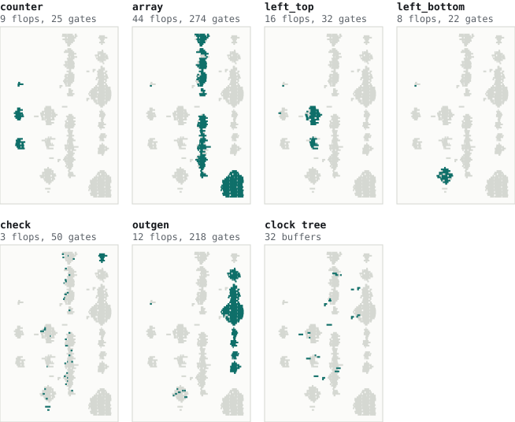
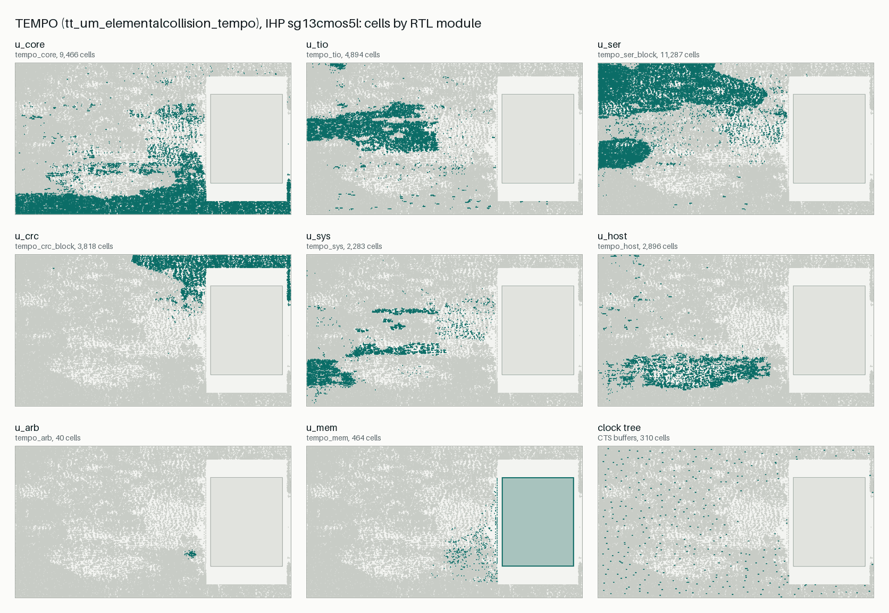
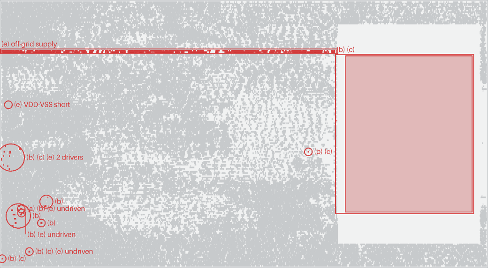

# Reverse-engineering Jane Street's ASIC puzzle: from GDS to "(* TWO STARS *)"

*RETRACE project writeup, 2026-09-19. Repository: [elementalcollision/retrace](https://github.com/elementalcollision/retrace) (public).*

**Answer.** The chip is an 11 x 11 Star Battle ("Two Not Touch") checker. Clocked in row
by row, one cell per enabled cycle, the only accepted grid raises `success` and makes the
chip print `(* TWO STARS *)` on `O[7:0]`.

```
. . . . . . . * . * .
* . . . . * . . . . .
. . . . . . . * . * .
* . * . . . . . . . .
. . . . * . * . . . .
. . * . . . . . * . .
. . . . * . . . . . *
. * . . . . * . . . .
. . . * . . . . . . *
. . . . . * . . * . .
. * . * . . . . . . .
```

**How we know.** Every stage of the inverse flow has its own oracle, and nothing downstream was
trusted until the stage above it passed. The answer was found twice, independently: once by
solving the puzzle from rules read out of proven RTL, and once by blind formal search on the
raw extracted netlist. Both routes returned the same 121 bits. A SAT lemma on the netlist
shows the solution is unique over every possible input sequence.

This was done after the contest closed (2026-09-04), as a learning exercise for our own ASIC
project, TEMPO. See [How this was built](#how-this-was-built): it was done end to end with
Claude Code agents, which the contest rules would not have allowed.

## The puzzle

Jane Street published a GDS (`puzzle.gds`), a sample waveform whose inputs do not solve it,
a hint image, and a fully worked warm-up: the same flow applied to a small adder, with
source, netlist, DEF and GDS. The task: recover a netlist from the layout, work out what
it does, find the input that raises `success`, and simulate the "output generator" to read
the answer.

What the GDS actually contains (measured, not assumed):

| | Puzzle | Warm-up |
|---|---|---|
| Process | SkyWater SKY130, `sky130_fd_sc_hd` | same |
| Die | 200 x 300 um | 100 x 100 um |
| Logic cells | 728 (1618 instances with taps, decaps, fill) | 79 (230) |
| Flops | 92: 84 `dfrtp_2`, 4 `dfstp_2`, 4 `dfxtp_2` | 16 |
| Ports | `clk rst_n enable I O[7:0] success` | `clk rst_n en A B S` |
| Names | cell masters and their pin labels intact; instance and net names stripped | same |

That last row sets the shape of the problem. There are no transistors to recognise: every
instance is a named library cell. What was removed is connectivity-by-name, so the
work is to rebuild connectivity from geometry and then understand 728 anonymous gates.

## Thesis: every stage has an oracle

Reverse engineering fails quietly: one missed via merges two nets, and everything you reason
about afterwards is fiction. TEMPO's verification answer to "is the RTL right?" is an
independent model, co-simulation, formal checks and a mutation campaign. RETRACE applies the
same answer to each stage of the inverse flow:

| Stage | Output | Oracle |
|---|---|---|
| Geometry to instances | placed cell list | warm-up DEF, exact (V1) |
| Pins | per-master pin conductors | PDK LEF pin rectangles (V2) |
| Connectivity | flat netlist | warm-up: DEF nets, graph isomorphism with the synthesised netlist, and a formal equivalence proof (V3); puzzle: a second, independent extractor (V4) and electrical sanity (V5) |
| Behaviour | simulation | the sample VCD, in two simulators with two sources of cell models (V6) |
| Intent | readable RTL | SAT per block and an unbounded end-to-end proof against the netlist (V7) |
| Answer | input sequence | two independent solving routes, plus uniqueness (V8) |

Because the warm-up ships every forward-flow stage, each inverse stage was built and proven
on it before touching the puzzle.

## 1. Recon: identify the exact PDK from geometry

The extractor trusts cell masters, so the first check compared each master's polygons in
the GDS against the PDK's copy (`cellcheck.py`, layer by layer, on a 1 nm grid). Against the
OpenLane 2 default PDK (`0fe599b2`), 3 of 69 masters differed: `o211a_2` and `and4b_2` on
poly or licon, the layers that form transistors, and `conb_1` on layer 95/20. Those
differences could have meant tampering. Scanning 25 of the 116 released sky130 builds settled
it: open_pdks **`8afc8346`** matches all 69 puzzle masters and
all 18 warm-up masters exactly. The differences were PDK revisions, and that build became
the pinned PDK.

## 2. Extraction: what a pin really is

Extractor 1 (`tools/retrace/extract.py`, gdstk + shapely) places each instance from the LEF
cell size and its GDS transform, builds pin conductors per master, and merges routing, via
pads and pins with union-find, joining layers only through via cuts. It runs on the puzzle in
0.7 s. The interesting part is what a *pin* is, and each answer below came from a check
failing:

1. **The pin-layer shapes are markers.** In these files `li1` datatype 16 is a 0.17 um square
   at each label, not the pin. A pin is the cell-internal conductor under the label.
   (Found by the DEF net comparison: nets split, and some pins were named wrongly.)
2. **A pin can be a met1 strap over separate li1 islands** (`xor2_2` B, `dfrtp_2` RESET_B),
   and the router lands on the strap. (Same check.)
3. **A pin can be two li1 islands joined only by gate poly** (`a31oi_2` A1: its LEF port
   lists both rectangles). In the puzzle, the router ran a net *through* such a pin. With
   metal-only connectivity, **both** extractors reported an undriven net there. What exposed
   it was a disagreement: KLayout reported an unnamed pin where ours saw nothing. Following
   poly through licon fixed both extractors.
4. **Tie cells reach the supplies through poly resistors.** Once poly was followed,
   `conb_1`'s HI output merged into VPWR. Poly is now cut at the PDK's resistor marker
   (66/15), which only `conb_1` uses.

Extractor 2 (`tools/l2n/`) is KLayout's hierarchical LayoutToNetlist engine with its own
connectivity rules and no shared code. The two agree net for net: warm-up 86/86, puzzle
719/719 multi-pin nets.

## 3. Proving the extraction

On the warm-up (ground truth at every stage):

* **V1:** all 230 placements equal the DEF.
* **V3a:** the net partition over (instance, pin) equals the DEF, 84/84 nets.
* **V3b:** the extracted netlist is a labelled-graph isomorph of the synthesised netlist
  (79 cells, 84 nets).
* **V3c:** a miter of the two netlists, from an asserted reset, is proven sequentially
  equivalent by SymbiYosys `abc pdr`, *without a name mapping*: PDR finds the state
  correspondence itself. A negative control (A0/A1 swapped on one `mux2_1`) fails. That
  matters, because a proof that passes instantly is also what a vacuous proof looks like.

On the puzzle (no ground truth):

* **V4:** the two extractors agree exactly.
* **V5:** power and ground are separate and reach all 1618 instances; every signal net has
  exactly one driver; no logic input floats. The only unloaded outputs are 15 `clkbuf_4`
  clock-tree dummy loads and unused tie outputs.
* **V6:** the extracted netlist replays the sample VCD with 1248 checks and 0 errors in
  Icarus (PDK Verilog models) and in Verilator (logic built from the Liberty functions).
  The sample prints `TRY AGAIN`, twice.

**Mutation campaign.** Does any of this notice a wrong extraction? 130 mutants over 10
operators, on both designs: deleted vias, near-miss wire shifts, shorts, flipped cells,
same-footprint master swaps, swapped pin labels, transistor-level tampering, deleted art,
changed path end caps, and inserted vias. Result: 90 killed, 39 equivalent (no electrical change), 1 survived. On the
warm-up, the ground-truth checks V3a and V3b alone kill 100% of the non-equivalent mutants. On
the puzzle, electrical sanity (67%) and the two simulators (59% and 57%) carry the weight.
The survivor is a `nor2_2` swapped for a `nand2_2`. That is not an extraction error: it is a
different chip, which only a behavioural oracle can see, and the sample VCD does not exercise
that gate. Once the recovered design existed, proving it against the mutant layout killed this
mutant as well.

## 4. Understanding: from 92 flops to six blocks

The fan-in cones gave the first cut: `success` is the output of a single flop, and each `O[i]`
is purely combinational logic over 16 flops (23 across the byte: the output generator's 12, the
star counter's 8 and the decision block's 3). The strongly connected components of the
flop-to-flop dependency graph, together with placement, gave six blocks: `counter` (9 flops),
`array` (44), `left_top` (16), `left_bottom` (8), `check` (3) and `outgen` (12). The layout
really is "arranged to hint": each block is a cluster on the die.



*Each panel highlights one block: its flops and every gate in the proven logic cone behind
them (`tools/viz/puzzle.py`). The flops were grouped with the help of their placement, but the
gates only by logic, so gates landing beside their own flops is the layout's hint, not ours.
`array` owns the centre column and the cluster at bottom right; `check`'s gates are strung
along the columns it reads. 14 gates are shared, 13 by two cones and one by five, and appear
in each of those panels; the seventh panel is the 32 clock buffers.*

**The V7 harness** (`tools/analysis/cone.py`) cuts the netlist at the flops. For each block it
exports the exact gate logic as a "gold" module (inputs: ports and current flop values;
outputs: next flop values and owned outputs). Recovered RTL for a block is accepted only if a
SAT miter proves it equal to the gold module. Six agents recovered one block each. Six
independent skeptics, one per block, re-ran each proof and tested each claim, and three blocks
got a repair pass.
An integration agent assembled `puzzle_recovered`. The whole design is then proven equal to
the extracted netlist by `abc pdr` (`tools/analysis/e2e.py`), with no assumption beyond the
initial reset. It takes about 2 s because the miter asserts all 92 flop pairs equal, not just
the outputs, which makes the property 1-inductive given the block proofs. Changing one byte of
a message makes the proof fail.

Three errors were caught in review, and each one is a lesson:

* **The harness itself was blind to `O`.** Nets named after bus bits were emitted as
  `wire O[3];`, which Verilog reads as a separate array, so the gold `O` was undriven and
  anything matched it. The self-test ("gold renamed as recovered passes") had the same defect
  on both sides. The outgen reviewer found it. The fix now carries a test that a flipped `O`
  bit fails.
* **Bit order: 11 versus 22.** The check block compares eight counter flops against the
  pattern `0000_1011` in flop-id order. The integration draft read that as "the counter must
  equal 11". The counter's real bit weights run in a different order, and simulating the proven
  counter from reset reaches the pattern after exactly 22 increments. 22 is also the only value
  consistent with the other conditions.
* **The same trap in the output generator.** "BIG BANG" is selected by the raw byte `0xAE`,
  with yet another bit order. That byte is the count 121: every cell lit.

## 5. What the chip is

| Block | Flops | Function |
|---|---|---|
| counter | 9 | base-11 column digit and row digit (0-10 each), plus a sticky `done` flag after 121 enabled cycles |
| array | 44 | 22 two-bit saturating bins: 11 irregular region masks and 11 column decodes |
| left_top | 16 | a 12-cell shift register of `I` (the current neighbourhood), with two sticky error flags: a per-row star count checked at the end of each row, and touching stars |
| left_bottom | 8 | star counter |
| check | 3 | the one-shot decision on the cycle `done` first rises; `success` latch; "touching" latch |
| outgen | 12 | message ROMs and a scrambler (an LFSR over `I`); prints the message after the decision |

`success` is set if and only if, at the decision: exactly 22 stars were entered; every
region and every column holds exactly 2; the row flag and the touching flag are clear. The
messages tell the story: `EMPTY SKY` for 0 stars, `BIG BANG` for all 121 cells, `TWO NOT
TOUCH` when everything is right except that stars touch, `TRY AGAIN` otherwise. On success,
`O` prints a table XORed with the scrambler, so the text is only readable for the right grid.

The region map (letters are the 11 regions, sizes 4 to 28 cells):

```
G G G G G I I F E E J
G G A G G I F F E E J
G G A I I I I F F E J
G G A I B B B J F F J
A G A I B J J J J J J
A A A I B B B J D D D
I I I I I I B J D K K
I H H H B B B J D K K
I H H C J J J J D K K
I I H C C J J J D D D
I H H C J J J J J J J
```

## 6. Solving it twice

* **Route A, analytical** (`tools/solve/starbattle.py`): derive every rule from the proven RTL
  by simulation (cell order, region masks, column bins, the exact behaviour of both flags,
  including that adjacency is king-move with no wraparound). Encode the rules in z3,
  including the flag logic unrolled over the 121-cell schedule, and enumerate by blocking each
  model. Result: exactly one solution.
* **Route B, formal** (`tools/solve/formal_solve.py`): no interpretation at all. SymbiYosys
  on the extracted netlist with `cover(success)` or `assert(!success)`, in four engines (yices,
  bitwuzla, `abc bmc3`, yices BMC). All four reach `success` at step 123 in 4 to 12 s. A second
  run adds a sticky "differs from the found sequence" register: no other sequence reaches
  `success` within depth 135.

The two agents could not see each other's work, and they returned the same 121 bits.

**Uniqueness over every input.** Both routes assume `enable` stays high through the 121
cells. A SAT lemma on every block's gold cone, i.e. on the netlist logic, closes that gap:
before the decision, a cycle with `enable` low changes no flop (the four no-reset flops are
forced to 0). A negative control fails. A run with gaps is therefore the same run with the
gaps removed, whatever `I` does during them, and after the decision the outcome is latched.

**Confirmation.** The answer was run on three models: the netlist in Icarus with the PDK
models, the netlist as Liberty logic in Verilator, and the recovered RTL. A separately written
testbench replayed it on a freshly extracted netlist with a 5-cycle reset, 17 `enable` gaps and
the wrong bit on `I` during every gap. Every run shows `success` high and the 15 bytes
`28 2a 20 54 57 4f 20 53 54 41 52 53 20 2a 29`: **`(* TWO STARS *)`**.
`answer/solution.vcd` is the winning run, in the format of the sample.

## 7. Transfer: an independent LVS for TEMPO

The test of whether this is a method rather than a one-off script is whether it carries over to
another process and a much larger design. The extractor now takes a technology table
(`tools/retrace/tech.py`: conductor and cut layers, the rule for joining a pin's islands,
physical and macro cells, supply names). `SKY130_HD` reproduces the puzzle work exactly, and
`IHP_SG13CMOS5L` is new. The puzzle and warm-up netlists extracted by the refactored code are
byte-identical to those from the committed pre-port code.

The target is TEMPO's sign-off GDS (IHP `sg13cmos5l`, 62,151 cell and macro instances, 335,134
references, one SRAM macro), checked against TEMPO's own DEF, final netlist and LEF. This is an LVS
independent of LibreLane's Magic and Netgen (`tools/tempo/lvs.py`, `docs/TEMPO_LVS.md`):

| Check | Result |
|---|---|
| placements vs DEF | 62,151 / 62,151 |
| net partition vs DEF, and vs the final netlist | 35,542 / 35,542, both |
| pins vs IHP LEF | 52 masters (51 cells and the SRAM), no mismatch |
| electrical sanity | 0 undriven, 0 multiply driven nets; one power net and one ground net, not shorted |
| cell geometry vs PDK | 51 / 51 masters identical |
| extractor 1 vs KLayout (V4) | 35,543 / 35,543 multi-pin nets |

It runs in about 20 s, and since 2026-09-19 it runs in TEMPO's CI after every sign-off
(first run: the CI-built `v0.2-signoff` GDS, all checks passing). Power connections (124,303
pins) and 157 single-pin nets are counted and excluded explicitly, because DEF's `NETS` and the
netlist do not list them.



*TEMPO's cells by RTL module, drawn from its own DEF (`tools/viz/tempo.py`). The netlist is
flat and its gates are anonymous, but the nets that registers drive keep hierarchical names
(`u_top.u_core.rf[3][7]`). Those registers seed the labels, and every other cell takes the
module of its nearest seed in the connectivity graph. Hiding a fifth of the seeds and labelling
from the rest gives 462 of 496 back (93%). Placement is not used, so
the modules' clustering on the die is independent evidence that the labels are right.*

What the port taught:

* **A 90-degree rotation path had never run.** The puzzle never rotates a cell, and TEMPO's
  SRAM is placed at orientation `E`. The orientation table and the DEF-offset formula now cover
  all eight orientations, checked against the macro's DEF placement.
* **A process-specific rule is not a general one.** IHP's tie cells need no poly-resistor cut.
  This was verified by running the join algorithm on the PDK's own `tiehi` and `tielo`, not
  assumed from sky130.
* **The pins check had a blind spot.** It compared pin-name sets, so two swapped labels on the
  same macro passed it (the net-partition checks still caught the swap). A geometric check now
  requires every LEF pin rectangle to sit on the extracted conductor of the same name. It passes
  on TEMPO (553 rectangles), and swapping two labels, on the SRAM or on a `nand2`, fails it.
* **The supply check could not fail.** It compared chip-level `VDD` and `VSS` labels, which
  TEMPO's GDS does not have, and the partition checks leave the supply nets out. A Metal1 bar
  from VDD to VSS inside a filler cell, in a copy of the sign-off GDS, passed every check. The
  check now works from each pin's LEF `USE`: every power pin on one net, every ground pin on
  another, never the same net. A short is located by a breadth-first search over touching
  shapes from the power pins to the first ground pin; the shape between them is the short.
* **Planted faults are now tests.** Six faults, one per failure class, are planted far apart in
  one copy of the sign-off GDS (`tools/tempo/faults.py`), and TEMPO's CI requires every check to
  report its own fault at the instances it touches and nothing anywhere else. When the LVS
  fails, CI draws where (`tools/viz/lvs_where.py`):



*The LVS on a copy of the sign-off GDS with six planted faults, as CI would draw it. Each ring
names the checks that flagged it: the long box is a VDD rail cut off from the power grid, (e)
found the VDD-VSS short at the planted bar, the tinted SRAM carries the two swapped labels
(which (d2) also names, pin by pin), and the rest are the removed via, the Metal2 bridge (two
drivers on one net) and the mirrored cell ((a), with its nets undriven). A mismatched net is
ringed wherever its cells are, so one fault can show in several places.*

## 8. Round trip: back through Jane Street's flow

The last stretch goal ran the method in reverse: rebuild Jane Street's forward flow, push our
recovered RTL through it, and check the new layout with our own tools (`docs/ROUNDTRIP.md` has
the full report, every number sourced).

**Which flow.** The files carry no tool versions, but they carry fingerprints. open_pdks
`8afc8346` is the default PDK of only one line of flows, LibreLane 3.0.x. The warm-up's clock
tree uses a non-default routing rule and CTS dummy loads that older OpenROAD versions do not
write, and the instance and net names are LibreLane's. The odd cell style (every gate at drive
strength `_2`, no fill, no timing buffers) turned out to be ordinary: the PDK's default list of
cells synthesis may not use, plus three non-default settings: module hierarchy kept, and design
repair and fill insertion off (the synthesis strategy is the default, `AREA 0`). The test was the warm-up: with those settings,
LibreLane 3.0.14's synthesis reproduces Jane Street's warm-up netlist exactly, down to instance
and net names.

**Is the puzzle padded?** No sign of it. Our proven-equivalent RTL, synthesized the same way,
gives 584 cells and 6,982 um^2 before the clock tree, against the puzzle's 696 and 8,034, with
the same 92 flops and the same cell style. The puzzle is 19% larger, but a reviewer found that
the delay-oriented `DELAY 0` strategy gives exactly 696 cells from our RTL, with the wrong gate
mix (no XOR gates, where the puzzle has 50). A different RTL partition or recipe could explain
the size (no tested recipe matches both the count and the mix); nothing requires a human hand. Only about 7 of the extra cells (tie cells feeding gates, one
feed-through buffer) can be pinned directly on kept module boundaries.

**The layout.** Hardened with LibreLane 3.0.14 and those settings, our design lands on the
puzzle's floorplan exactly: all 880 tap and end cells at the same positions, the 13 pins, the 30
power straps and the clock tree's shape (a `clkbuf_16` root, 16 leaves, 15 dummy loads). What
differs is the gate count, 10 antenna diodes the puzzle has and we do not need, and placement:
Jane Street's dense clusters come from a mechanism we did not identify. Without fill, the n-well
breaks at every gap: 211 of its pieces have no tap and the narrowest gaps violate spacing, so DRC
and LVS fail. `puzzle.gds` fails the same checks the same way (731 Magic DRC findings, 127
untapped n-well islands). With fill turned on, the same layout is DRC and LVS clean.


*Each recovered block in Jane Street's layout (top) and in ours (bottom), same scale. The
floorplans match; placement does not: our placer spreads each block, where Jane Street's layout
packs cells into dense clusters, each block split over several. `tools/roundtrip/vs_puzzle.py` measures it: a flop lands 82 um
(median) from its puzzle counterpart.*

**Closing the loop.** Our GDS passes every oracle RETRACE built for the puzzle: placements,
pins, nets against LibreLane's own DEF and netlist, the second extractor, cell geometry against
the PDK. Its extracted netlist is proven equivalent to the recovered RTL, and also directly to
the puzzle's extracted netlist: two different layouts, one machine, proven in about a second each
by the same kind of PDR miter as before, with one-gate mutants failing. Replayed on our layout,
the winning input raises `success` and prints `(* TWO STARS *)`. `.github/workflows/roundtrip.yml`
repeats the hardening and every check on a GitHub-hosted x86-64 runner in about 13 minutes; its
first run gave byte-identical synthesis, DEF, netlists and extracted netlist to the arm64 run
they were developed on.

## 9. Naming what is in an anonymous netlist, and a blind test of it

The last stretch goal asks a different question: given a netlist with every name stripped, can a
program say *this is a counter, this is a shift register, these flops are one word* — and can that
answer be **proved** rather than believed? (`docs/S3.md` is the full report, every figure sourced.)

**The design point is who builds the template.** A recogniser that says "proven" has proved
nothing. So the harness, not the recogniser, constructs each kind's defining template from the
kind, bit order and parameters it was given, and checks it on its own copy of the netlist, under
four obligations: extent (no counter narrower than two bits, no shift register shallower than
three), liveness (every claimed bit must be able to move, so a structure cannot be padded with
passengers), coverage (a reset case a higher-priority one shadows is vacuous), and hold (a
counter must say when it holds, and an opaque load case may not be the thing that empties that
region). A restatement of a flop's own next-state function therefore verifies nothing. On the
blind set the recogniser claimed 215 structures "proven"; the harness proved **40**.

**The evaluation was pre-registered.** The candidate pool — 84 third-party Tiny Tapeout designs
on sky130, chosen by criteria that look at no design's structure beyond its size and cell library
— was registered before the recogniser existed. Code, protocol, truths and a 128-bit draw seed
were frozen in one commit; ten designs were then drawn with that seed, labelled by the frozen
labeller, and each run once. No design was replaced by a reserve, and the harness refuses to
start if anything under `tools/s3/` has changed.

**What it found.** 59 of 94 structure-kind registers found (0.628), the structure behind 41 of
them certified (0.436). Only `counter` has enough support to be called a rate: 41 of 59 found, 23
certified — **below** the estimate published before the freeze (0.636, Fisher p = 0.017).
Synchronizers 17 of 18, shift registers 1 of 8, and LFSR/CRC 0 of 9, all nine of which sit in one
design. Two things held up: bit order, perfect on every counter it found (2,797 pairs, against a
chance of 0.5), and word grouping, whose AMI of 0.8425 sits level with its reference in absolute
terms and further above its own chance floor than the reference sits above its.

**What it cost is the more useful half.** Every found-but-uncertified register in the whole blind
set is one obligation — the hold rule refusing a structure whose hold region empties only once an
opaque load is conjoined in — which is the rule working, and a ceiling on what this slice can
certify. Two certified counter moduli were nonetheless *wrong*, which the report names rather than
averages away. And a quarter of the ground truth is not established: on 23 of the 94 registers the
frozen labeller's own equivalence proof contradicts its own labels, 16 of them in the single
design that supplies every LFSR register — so the kind that scored zero was measured against
labels that are not sound. The reference is not clean either: one design in the pre-published
holdout was written from puzzle knowledge. Reporting a result whose denominator you distrust is
less comfortable than reporting the number alone, and it is the only version worth publishing.

**Then it was run again.** A result from ten designs is a small sample, so a second freeze drew ten
more from the pool, excluding every design the first evaluation had already seen, and re-ran the
same recognizer, byte for byte. What would count as "the same result" was written down and
committed before the new seed existed. Counter recall on proved structures came out at 19 of 49
(0.388) against the first run's 23 of 59 (0.390): by the pre-registered rule, **consistent**, and
42 of 108 (0.389) over all twenty designs. Every figure was computed once from the raw records and
recomputed independently with separate code; the two agreed on 213 of 216, and the other three
differed only in the order of their random draws (`docs/S3_REPLICATION.md`). The replication also
found a defect in the frozen labeller itself — it cannot label a shift register that synthesis has
partly removed — which cost two drawn designs, and which the report records rather than hides.

## Easter eggs

* A row of rectangles below the die, in two widths with a 1:3 ratio: Morse code for
  **PER ARENAM AD ASTRA**, "through sand to the stars" (silicon, then the Star Battle).
* 1366 met2 squares, 0.3 um each, draw a 57 x 57 logo of four broken concentric rings,
  in both the puzzle and the warm-up. They extract as three floating islands that touch no
  signal.
* The sample VCD is dated `Sat Dec 31 23:59:60 2016`, the 2016 leap second, and its version
  string reads "Leave no stone unturned!".
* `EMPTY SKY`, `BIG BANG` and `TWO NOT TOUCH` are reachable in their own right. Simulated on
  the extracted netlist: 0 stars prints `EMPTY SKY`, all 121 cells print `BIG BANG`, and a grid
  that obeys every rule except that stars touch prints `TWO NOT TOUCH` (`test/test_messages.py`).

## What this project developed, and where it applies

Most of what follows is a new *combination* of established techniques (union-find extraction,
LVS-style partition comparison, PDR equivalence, mutation testing) rather than a new algorithm.
We have not done a prior-art search, so nothing here should be read as a novelty or
patentability claim. Note also that the repository is public under Apache-2.0, which carries an
express patent licence to users. Each item names the code path that implements it.

| # | Technique or finding | Code path | What is new here | Future applications |
|---|---|---|---|---|
| 1 | **PDK fingerprinting from cell geometry**: compare every embedded master, layer by layer on a 1 nm grid, against candidate PDK builds, and identify the exact build | `tools/retrace/cellcheck.py` | identifies a PDK *release* from a GDS alone (sky130 `8afc8346` out of 116 builds) and separates revision drift from tampering | supply-chain provenance for shuttle and foundry GDS; detecting modified standard cells (cell-level hardware Trojans); reproducing a third-party flow exactly |
| 2 | **Pins as cell-internal conductors**: li1/met1 through contacts, islands joined through gate poly, poly cut at resistor markers; detects routes that pass *through* a cell's pin | `tools/retrace/extract.py` (`_master_pins`), `tools/retrace/tech.py` | a cell-level extractor that needs no SPICE extraction, yet is right on multi-island pins and tie cells | fast, independent LVS for standard-cell designs; recovering netlists from GDS for audits, repair or porting |
| 3 | **Discovery: the router uses a gate-poly-joined pin as a feedthrough** (sky130 `a31oi_2` A1; legal by LEF, electrically a path through poly) | finding in `docs/STATUS.md`, check in V2 (`test/test_pins.py`) | shows up as an "undriven net" in any metal-only extractor | a lint for nets that rely on a pin feedthrough (resistance and timing risk); a regression case for extraction tools |
| 4 | **Differential dual extraction**: two independent extractors, compared as net partitions keyed by `master@origin`, used to find *shared* blind spots | `tools/l2n/`, `tools/l2n/compare.py` | disagreement over how a pin was *reported* exposed an error both extractors made | independent sign-off cross-check for open-source flows; CI for extraction and LVS tools |
| 5 | **Name-free equivalence proofs**: PDR on a miter needs no name map; probe ports make an end-to-end proof 1-inductive (all flops asserted equal), about 2 s for the whole chip | `formal/warmup_miter.sv`, `tools/analysis/e2e.py`, `formal/recovered_miter.sv` | LEC without correspondence points, and a way around Yosys losing hierarchical references after `flatten` | checking re-synthesised, recovered or ECO'd netlists; regression oracle for layout changes (it caught the one mutant nothing else did) |
| 6 | **Mutation testing of an extractor**: 10 layout operators with electrical-equivalence classification | `tools/retrace/mutate.py`, `test/mutation/campaign.py` | measures what each check layer actually catches, instead of assuming it | qualifying LVS and extraction tools; coverage metrics for sign-off; regression when porting a PDK |
| 7 | **Gold-cone acceptance harness for machine-recovered RTL**: cut the netlist at flops, SAT-prove each recovered block, then the whole design | `tools/analysis/cone.py`, `tools/analysis/e2e.py`, `rtl_recovered/` | AI-written RTL is accepted only by proof, with independent skeptic agents on top | AI-assisted reverse engineering with guarantees; modernising legacy gate-level netlists into maintainable RTL; teaching |
| 8 | **Stutter lemma for input uniqueness**: SAT-prove that a disabled cycle changes no state, which extends a bounded formal uniqueness result to every input schedule | `test/test_uniqueness.py` | turns "unique among contiguous inputs" into "unique among all inputs" with one combinational proof | proving uniqueness or robustness of unlock, licence and key-check circuits; handshake and back-pressure robustness proofs |
| 9 | **VCD to self-checking testbench** | `tools/retrace/vcdtb.py` | a one-command golden-trace oracle for any netlist or RTL | silicon bring-up (TEMPO test layer L6); regression against captured traces |
| 10 | **Technology-independent extractor** (`Tech` table; sky130 and IHP `sg13cmos5l`), including general 8-orientation placement and macro black-boxing | `tools/retrace/tech.py`, `tools/tempo/lvs.py` | the same extractor checks TEMPO's 62,151-instance sign-off GDS, independently of LibreLane's Magic and Netgen | a second LVS for every Tiny Tapeout or IHP shuttle design; gf180 and other open PDKs by adding a table |
| 11 | **Bit-order audit discipline**: a register pattern is not a number until its bit weights are proven | lead-review corrections in `docs/INTENT.md` | caught two misreadings (11 for 22, `0xAE` for 121) that proven RTL could not | review checklists for recovered designs; any work that reads constants out of netlists |
| 12 | **Tooling pitfalls found**: `wire O[3];` from bus-bit net names silently disconnects the port; hierarchical references are left undriven after Yosys `flatten`; gdstk may write a rewritten straight path back as a polygon | `tools/analysis/cone.py`, `docs/INTENT.md` §6, `docs/MUTATION.md` | each produced a *passing* check that was vacuous | lint rules for netlist emitters and formal harnesses; upstream bug reports |
| 13 | **Planted-fault regression for an LVS**: six faults (via open, mirrored cell, Metal2 bridge, swapped macro labels, supply short, a rail cut off from the grid) planted far apart in one copy, sites chosen by rule, each required to be reported at its own instances and nowhere else | `tools/tempo/faults.py`, `test/test_tempo.py` | every check shown able to fail, and where, on every sign-off, for one extra extraction; it found a supply check that could not fail | qualifying any LVS or extraction flow on a real design; catching checks that silently stop working |
| 14 | **Supply-short locator**: breadth-first search over touching shapes from every power pin to the first ground pin; the non-pin shapes on that shortest path are the short | `tools/tempo/lvs.py` (`locate_supply_short`) | turns "VDD and VSS are one net" into a place on the die | debugging shorts in any open flow; CI images that show where an LVS failed |
| 15 | **Module map of a flat netlist**: seed cells from the register nets that keep hierarchical names, label the rest by nearest seed in the connectivity graph, check by holding out seeds; placement not used | `tools/viz/tempo.py`, `tools/viz/layout.py` | a flat, anonymous netlist drawn by RTL module, with a measured accuracy; the clustering on the die is independent evidence | floorplan review after synthesis flattens the design; datasheet figures; a labelled test set for structure recognition (PRD S3) |
| 16 | **Flow forensics and a calibrated round trip**: identify a third party's flow and version from its GDS (PDK pin, clock-tree rules and dummy loads, naming, tap/pin/PDN geometry), calibrate synthesis on a known design until the netlist matches by name, harden the recovered RTL, and prove the two layouts equivalent | `tools/roundtrip/` | reproduces Jane Street's floorplan exactly and proves their layout and ours implement the same machine | provenance of shuttle and third-party GDS; reproducing a published flow; carrying recovered designs through a real flow as a regression |

| 17 | **Kind-bound verification of a recovered structure**: the harness, not the recogniser, builds each kind's defining template from the declared kind, order and parameters and proves it on its own graph, under extent, liveness, coverage and hold obligations a padded or carved-out structure cannot pass | `tools/s3/verify.py`, `tools/s3/schema.py` | separates "the recogniser says proven" (215) from "the harness proved it" (40) on the same run, and the gap is reported per structure with its reason | qualifying any netlist-structure recogniser; accepting machine-proposed structure in reverse engineering, IP audits or legacy-netlist modernisation |
| 18 | **Pre-registered blind evaluation for a reverse-engineering tool**: register the candidate pool by structure-blind criteria before the code exists, freeze code, protocol, truths and a random seed in one commit, draw the test set with that seed afterwards, and publish the misses with their causes | `tools/s3/freeze.py`, `tools/s3/thirdparty.py`, `docs/S3.md` | a self-deception budget spent up front: a hash-chained attempt ledger, a contamination record naming every path by which knowledge reached development, and a refusal to start if any frozen file changed | honest benchmarking of EDA and security tools, where the author writes the tool, the test set and the scoring |

## Lessons that transfer

1. **Make every proof prove it can fail.** Four of our "passes" would have been vacuous
   without a planted negative: the warm-up PDR proof, the per-block V7 harness (which really
   was blind to `O`), the uniqueness lemma, and TEMPO's supply check, which read labels that
   TEMPO's GDS does not have.
2. **Disagreement is the most valuable signal.** The poly-joined pin bug fooled both
   extractors in the same way. Only a difference in how each *reported* that pin exposed it.
   Two independent implementations of the same step are worth their cost.
3. **Bit order is where interpretation goes wrong.** The gates were proven correct. The
   error was in reading a correct pattern as a number.
4. **Separate "the extraction is right" from "this is the chip".** Extraction checks are
   blind to a legitimate different chip. The recovered, proven RTL is what turns into a
   regression oracle for that.
5. **Agents with skeptics.** Agents drafted, independent agents tried to refute, and the
   lead re-ran every decisive check. Every error listed in this writeup was caught by an
   oracle, a reviewer or a negative control, not by the one who made it. This writeup was
   itself fact-checked claim by claim by three more agents, which found 13 problems, all
   fixed, including a reproduction command that did not work from a clean checkout.
6. **A rule that looks like "how this process works" may really be "how this specific process
   works."** The sky130 poly-resistor cut and the untested 90-degree-rotation code path (§7)
   were both invisible until a second process and a second, larger design exercised them.
7. **A matching count is not a match.** One synthesis strategy gives exactly the puzzle's 696
   cells from our RTL, and the wrong gate mix. Calibrating on the warm-up, where the answer is
   known down to net names, is what made the strategy question answerable at all.
8. **Decide how you will be wrong before you can see the answer.** The blind evaluation's value
   came almost entirely from choices made before the test set existed: pool criteria that look at
   no design's structure, a seed drawn and committed in advance, a rule that a design may be
   replaced only if labelling fails and never because it looks hard, and a written contamination
   record. Every one of them removed a decision we would otherwise have made *after* seeing a
   number we did not like.
9. **Check the reference, not just the result.** The blind grouping score looked like a tie with
   its published reference until someone asked what chance looked like on each side: a random
   partition already scores 0.70 on the synthetic reference and 0.00 on real third-party designs.
   The same reference turned out to contain a design written from puzzle knowledge. A benchmark
   number is a claim about two populations, and only one of them is usually examined.

## How this was built

RETRACE was run by Claude Code (Claude Opus 5 as lead, Sonnet 5 subagents for parallel
work), directed by the project owner, on 2026-09-18 and 19, after the contest deadline. The
contest rules, as stated in the announcement post, prohibited feeding the puzzle files to AI
tools and using AI for writeups, so this is not a contest entry. The approach kept one line on purpose: AI wrote and ran *tools*, and the tools
did the analysis, so every result here can be reproduced from the repository without an AI in
the loop. Four multi-agent phases used 27 subagent runs (about 4.5 M subagent tokens): intent recovery
and the mutation campaign (18 runs, 83 minutes of wall time), solving (3, 31 minutes), fact-checking
this writeup (3, 10 minutes) and the IHP port (3, 61 minutes).

Stack: gdstk, shapely, KLayout (Python), Yosys, SymbiYosys (abc pdr, abc bmc3, smtbmc with
yices and bitwuzla), Icarus Verilog, Verilator, z3, networkx; sky130 via ciel
(open_pdks `8afc8346`).

## Reproduce

```bash
.venv/bin/python -m pytest -q                       # V1-V8, uniqueness, mutation smoke tests
.venv/bin/python -m tools.retrace.extract upstream/puzzle.gds --verilog out/puzzle.v
.venv/bin/python -m tools.analysis.e2e              # recovered RTL == extracted netlist
.venv/bin/python -m tools.solve.formal_solve        # route B
.venv/bin/python -m tools.solve.starbattle          # route A
.venv/bin/python -m tools.analysis.eastereggs       # Morse strip and pixel art
.venv/bin/python -m tools.tempo.lvs                 # G6: IHP port, LVS against TEMPO's sign-off GDS
.venv/bin/python -m pytest -q test/test_tempo.py    # skips cleanly without the TEMPO checkout
```

All tests pass (358 passed, 9 skipped). For a while after the blind evaluation one did not:
`test_permutation_counts_and_record_locations` required every record in `out/s3/runs` to be marked
blind, but the protocol writes an *attempt* record there that carries no such mark, so the test had
passed only while no blind run had ever been made. The test and the code it checks were both inside
the freeze, so the fix went into a superseding one, Freeze 2, where an attempt record is admitted only
when the hash-chained ledger vouches for it (`docs/S3.md` §14 and §17).

Details: `docs/STATUS.md` (ledger), `docs/INTENT.md` (design), `docs/MUTATION.md`,
`docs/SOLUTION.md`, `docs/SOLVE_ANALYTICAL.md`, `docs/SOLVE_FORMAL.md`, `docs/TEMPO_LVS.md`
(the G6 port and LVS), `docs/S3.md` and `docs/S3_DESIGN.md` (structure recognition).
